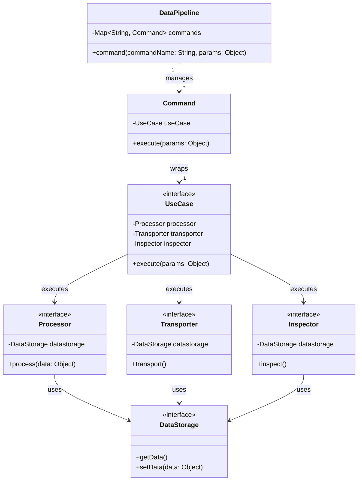
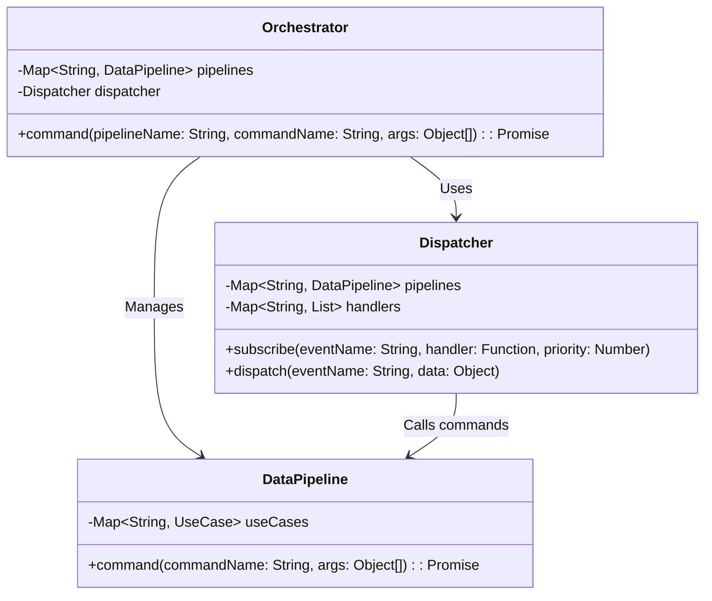
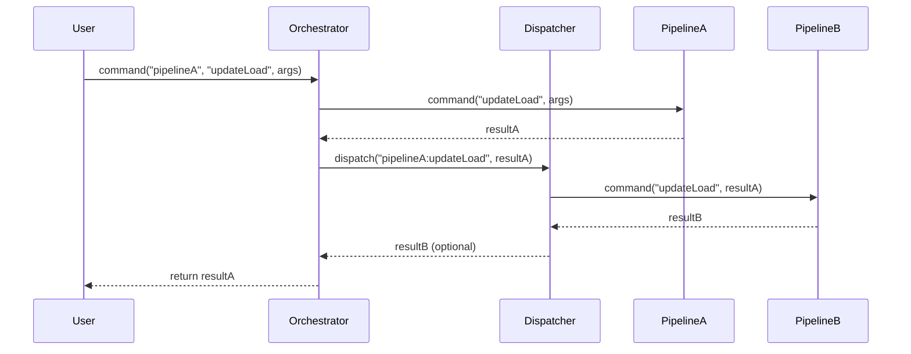
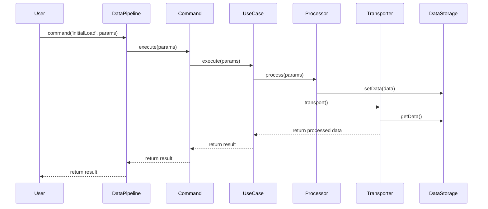

# Todo Orchestrator

Todo Orchestrator is a Vue.js application that helps you manage your tasks efficiently. It includes features for creating, updating, and deleting tasks, as well as viewing tasks in different states such as Todo, Done, and Canceled.

## Features

- **Todo Management**: Create, update, and delete tasks.
- **Task States**: View tasks in different states (Todo, Done, Canceled).
- **Summary View**: Get a quick overview of the number of tasks in each state.

## Project Structure

```
src/
├── components/
│   ├── MainPage.vue
│   ├── SectionSummary.vue
│   ├── SectionJobContents/
│   │   ├── SectionJobContents.vue
│   │   ├── TodoContents/
│   │   │   └── TodoContents.vue
│   │   ├── DoneContents.vue
│   │   └── CanceledContents.vue
├── App.vue
├── main.js
├── logic/
│   ├── core/
│   │   ├── task/
│   │   │   ├── orchestrator/
│   │   │   │   └── config.js
│   │   │   ├── pipelines/
│   │   │   │   ├── cancel/
│   │   │   │   │   └── config.js
│   │   │   │   ├── done/
│   │   │   │   │   └── config.js
│   │   │   │   ├── summary/
│   │   │   │   │   └── config.js
│   │   │   │   └── todo/
│   │   │   │       └── config.js
│   ├── shared/
│   │   ├── orchestrator/
│   │   ├── pipeline/
│   │   └── utils/
tests/
├── components/
│   ├── SectionSummary.spec.js
│   ├── SectionJobContents.spec.js
│   ├── TodoContents.spec.js
│   ├── DoneContents.spec.js
│   └── CanceledContents.spec.js
└── logic/
```

## Setup

1. **Clone the repository**:
    ```sh
    git clone https://github.com/your-username/todo_orchestrator.git
    cd todo_orchestrator
    ```

2. **Install dependencies**:
    ```sh
    npm install
    ```

3. **Run the development server**:
    ```sh
    npm run serve
    ```

4. **Run unit tests**:
    ```sh
    npm run test:unit
    ```

## Usage

- **View Tasks**: Navigate to the main page to view tasks in different states.
- **Add Task**: Use the input field and button to add a new task.
- **Update Task**: Click on a task to mark it as done or cancel it.
- **Delete Task**: Click the delete button next to a task to remove it.

## Logic Separation

This project uses a Data Pipeline and Orchestrator pattern to separate logic. The Data Pipeline handles the data flow and processing, while the Orchestrator manages the pipelines and dispatches events.

### Data Pipeline



### Orchestrator



### Orchestrator Data Flow



1. User executes the `updateLoad` command on `PipelineA` through the Orchestrator.
2. `PipelineA` executes the command and returns `resultA` to the Orchestrator.
3. The Orchestrator dispatches the event `pipelineA:updateLoad` with `resultA` to the Dispatcher.
4. The Dispatcher executes the `updateLoad` command on `PipelineB` with `resultA`.
5. `PipelineB` returns `resultB` to the Dispatcher, which optionally returns it to the Orchestrator.
6. The Orchestrator returns `resultA` to the User.

### DataPipeline Data Flow



1. User calls the `initialLoad` command on the DataPipeline.
2. DataPipeline executes the Command, which in turn executes the UseCase.
3. The UseCase processes the data using the Processor and stores it in DataStorage.
4. The UseCase then uses the Transporter to retrieve the processed data from DataStorage.
5. The Transporter returns the processed data to the UseCase.
6. The UseCase returns the result to the Command, which returns it to the DataPipeline.
7. The DataPipeline returns the result to the User.

## Contributing

Contributions are welcome! Please open an issue or submit a pull request for any improvements or bug fixes.

## License

This project is licensed under the MIT License. See the [LICENSE](LICENSE) file for details.